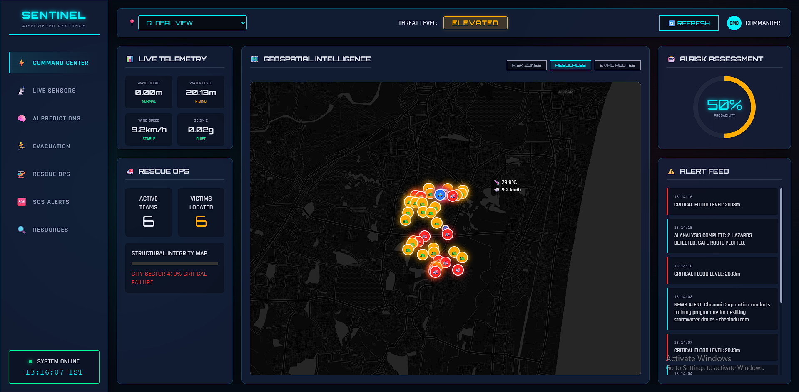

# 🌍 Disaster Management System

A comprehensive, real-time situational awareness dashboard designed for monitoring environmental hazards, managing resources, and coordinating disaster response. This system integrates real-time sensor data, geospatial intelligence, and public safety alerts into a unified command center interface.



---

## 🚀 Features

### 🖥️ Web Command Dashboard
- **Real-time Monitoring**: Live visualization of Buoy (Water Level, Wave Height) and Landslide (Soil Moisture, Displacement) sensor data.
- **Interactive Map**: 
  - **Risk Zones**: Dynamic heatmaps tailored to flood and landslide risks.
  - **Resource Tracking**: Real-time location of rescue units, hospitals, and shelters.
  - **Evacuation Routes**: AI-optimized safe paths avoiding hazard zones using OSRM.
  - **SOS Markers**: Live distress signals from the mobile app.
- **External Data Integration**:
  - 🌦️ **Weather**: Real-time forecasts via Open-Meteo.
  - 📉 **Seismic**: Live earthquake data from USGS.
  - 📰 **News**: Local disaster-related news feed.
- **Alert Management**: Centralized panel to view, acknowledge, and resolve system and SOS alerts.

### 📱 Mobile SOS App (Flutter)
- **Emergency SOS**: Single-tap distress signal sending GPS coordinates to the dashboard.
- **Status Updates**: Users receive real-time updates on their rescue status.
- **Resource Map**: View nearby shelters and safe zones.

---

## 🛠️ Technology Stack

### Frontend (Web Dashboard)
- **Core**: HTML5, CSS3, JavaScript (ES6+)
- **Map Engine**: [Leaflet.js](https://leafletjs.com/) with CartoDB Dark Matter tiles.
- **Charts**: [Chart.js](https://www.chartjs.org/) for data visualization.
- **Icons**: FontAwesome & Material Icons.
- **Styling**: Custom CSS with Glassmorphism and Neumorphism design elements.

### Backend & Infrastructure
- **Platform**: [Supabase](https://supabase.com/) (Backend-as-a-Service)
- **Database**: PostgreSQL with PostGIS extensions.
- **Real-time**: Supabase Realtime subscriptions for live data updates.

### mobile App
- **Framework**: [Flutter](https://flutter.dev/) (Dart)
- **Maps**: Google Maps Flutter / Mapbox (depending on configuration).

### External APIs
- **Weather**: [Open-Meteo API](https://open-meteo.com/)
- **Earthquakes**: [USGS Earthquake Hazards Program](https://earthquake.usgs.gov/)
- **Routing**: [OSRM (Open Source Routing Machine)](http://project-osrm.org/)
- **News**: Google News RSS via RSS2JSON.
- **Geocoding**: BigDataCloud API.

---

## 📂 Project Structure

```
Disaster-Management-System/
├── index.html              # Main Dashboard UI
├── app.js                  # Core Application Logic, Map & API Handlers
├── styles.css              # Main Styling (Dark/Futuristic Theme)
├── config.js               # Supabase & API Configuration
├── database-setup.sql      # Database Schema & Seed Data
├── flutter_sos_app/        # Mobile Application Source Code
└── Documentation/          # Guides (Deployment, Testing, etc.)
```

---

## ⚡ Quick Start Guide

### 1. Prerequisites
- A [Supabase](https://supabase.com/) account.
- A modern web browser.
- (Optional) Flutter SDK for mobile app development.

### 2. Database Setup
1. Create a new project in Supabase.
2. Go to the **SQL Editor** in your Supabase dashboard.
3. Open `database-setup.sql` from this repository.
4. Copy and paste the contents into the SQL Editor and run it. This will:
   - Create necessary tables (`buoys`, `landslide_poles`, `alerts`, `sos_alerts`).
   - Set up Row Level Security (RLS) policies.
   - Insert sample data for testing.

### 3. Application Configuration
1. Rename `config.json` (if exists) or create `config.js` in the root directory.
2. Update it with your Supabase credentials:
   ```javascript
   // config.js
   export const SUPABASE_URL = "YOUR_SUPABASE_URL";
   export const SUPABASE_KEY = "YOUR_SUPABASE_ANON_KEY";
   ```

### 4. Running the Dashboard
Simply serve the root directory using any static file server.
- **VS Code Extension**: Right-click `index.html` -> "Open with Live Server".
- **Python**: `python -m http.server 8000`
- **Node**: `npx http-server`

### 5. Running the Mobile App
1. Navigate to `flutter_sos_app/`.
2. Run `flutter pub get` to install dependencies.
3. Update `lib/main.dart` (or config file) with your Supabase credentials.
4. Run on a simulator or device: `flutter run`.

---

## 📖 Documentation
- [**START-HERE.md**](START-HERE.md): Guide for new developers.
- [**QUICKSTART.md**](QUICKSTART.md): 5-minute setup guide.
- [**PROJECT-STRUCTURE.md**](PROJECT-STRUCTURE.md): Detailed architectural overview.
- [**DEPLOYMENT.md**](DEPLOYMENT.md): Production deployment instructions.

---

## 🛡️ License
This project is open-source and available under the **MIT License**.

---

*Developed for Advanced Disaster Management.*